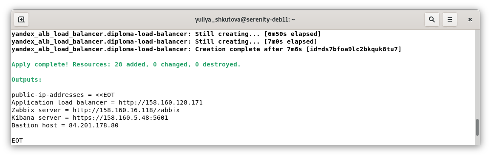

#  Дипломная работа по профессии «Системный администратор» Юлия Ш. SYS-19

<details>
<summary><h2>Задание</h2></summary>
  
> Содержание
> ==========
> * [Задача](#Задача)
> * [Инфраструктура](#Инфраструктура)
>     * [Сайт](#Сайт)
>     * [Мониторинг](#Мониторинг)
>     * [Логи](#Логи)
>     * [Сеть](#Сеть)
>     * [Резервное копирование](#Резервное-копирование)
>     * [Дополнительно](#Дополнительно)
> * [Выполнение работы](#Выполнение-работы)
> * [Критерии сдачи](#Критерии-сдачи)
> * [Как правильно задавать вопросы дипломному руководителю](#Как-правильно-задавать-вопросы-дипломному-руководителю) 
> 
> ---------
> 
> ## Задача
> Ключевая задача — разработать отказоустойчивую инфраструктуру для сайта, включающую мониторинг, сбор логов и резервное копирование основных данных. Инфраструктура должна размещаться в [Yandex Cloud](https://cloud.yandex.com/) и отвечать минимальным стандартам безопасности: запрещается выкладывать токен от облака в git. Используйте [инструкцию](https://cloud.yandex.ru/docs/tutorials/infrastructure-management/terraform-quickstart#get-credentials).
> 
> **Перед началом работы над дипломным заданием изучите [Инструкция по экономии облачных ресурсов](https://github.com/netology-code/devops-materials/blob/master/cloudwork.MD).**
> 
> ## Инфраструктура
> Для развёртки инфраструктуры используйте Terraform и Ansible.  
> 
> Не используйте для ansible inventory ip-адреса! Вместо этого используйте fqdn имена виртуальных машин в зоне ".ru-central1.internal". Пример: example.ru-central1.internal  
> 
> Важно: используйте по-возможности **минимальные конфигурации ВМ**:2 ядра 20% Intel ice lake, 2-4Гб памяти, 10hdd, прерываемая. 
> 
> **Так как прерываемая ВМ проработает не больше 24ч, перед сдачей работы на проверку дипломному руководителю сделайте ваши ВМ постоянно работающими.**
> 
> Ознакомьтесь со всеми пунктами из этой секции, не беритесь сразу выполнять задание, не дочитав до конца. Пункты взаимосвязаны и могут влиять друг на друга.
> 
> ### Сайт
> Создайте две ВМ в разных зонах, установите на них сервер nginx, если его там нет. ОС и содержимое ВМ должно быть идентичным, это будут наши веб-сервера.
> 
> Используйте набор статичных файлов для сайта. Можно переиспользовать сайт из домашнего задания.
> 
> Создайте [Target Group](https://cloud.yandex.com/docs/application-load-balancer/concepts/target-group), включите в неё две созданных ВМ.
> 
> Создайте [Backend Group](https://cloud.yandex.com/docs/application-load-balancer/concepts/backend-group), настройте backends на target group, ранее созданную. Настройте healthcheck на корень (/) и порт 80, протокол HTTP.
> 
> Создайте [HTTP router](https://cloud.yandex.com/docs/application-load-balancer/concepts/http-router). Путь укажите — /, backend group — созданную ранее.
> 
> Создайте [Application load balancer](https://cloud.yandex.com/en/docs/application-load-balancer/) для распределения трафика на веб-сервера, созданные ранее. Укажите HTTP router, созданный ранее, задайте listener тип auto, порт 80.
> 
> Протестируйте сайт
> `curl -v <публичный IP балансера>:80` 
> 
> ### Мониторинг
> Создайте ВМ, разверните на ней Zabbix. На каждую ВМ установите Zabbix Agent, настройте агенты на отправление метрик в Zabbix. 
> 
> Настройте дешборды с отображением метрик, минимальный набор — по принципу USE (Utilization, Saturation, Errors) для CPU, RAM, диски, сеть, http запросов к веб-серверам. Добавьте необходимые tresholds на соответствующие графики.
> 
> ### Логи
> Cоздайте ВМ, разверните на ней Elasticsearch. Установите filebeat в ВМ к веб-серверам, настройте на отправку access.log, error.log nginx в Elasticsearch.
> 
> Создайте ВМ, разверните на ней Kibana, сконфигурируйте соединение с Elasticsearch.
> 
> ### Сеть
> Разверните один VPC. Сервера web, Elasticsearch поместите в приватные подсети. Сервера Zabbix, Kibana, application load balancer определите в публичную подсеть.
> 
> Настройте [Security Groups](https://cloud.yandex.com/docs/vpc/concepts/security-groups) соответствующих сервисов на входящий трафик только к нужным портам.
> 
> Настройте ВМ с публичным адресом, в которой будет открыт только один порт — ssh. Настройте все security groups на разрешение входящего ssh из этой security group. Эта вм будет реализовывать концепцию bastion host. Потом можно будет подключаться по ssh ко всем хостам через этот хост.
> 
> ### Резервное копирование
> Создайте snapshot дисков всех ВМ. Ограничьте время жизни snaphot в неделю. Сами snaphot настройте на ежедневное копирование.
> 
> ### Дополнительно
> Не входит в минимальные требования. 
> 
> 1. Для Zabbix можно реализовать разделение компонент - frontend, server, database. Frontend отдельной ВМ поместите в публичную подсеть, назначте публичный IP. Server поместите в приватную подсеть, настройте security group на разрешение трафика между frontend и server. Для Database используйте [Yandex Managed Service for PostgreSQL](https://cloud.yandex.com/en-ru/services/managed-postgresql). Разверните кластер из двух нод с автоматическим failover.
> 2. Вместо конкретных ВМ, которые входят в target group, можно создать [Instance Group](https://cloud.yandex.com/en/docs/compute/concepts/instance-groups/), для которой настройте следующие правила автоматического горизонтального масштабирования: минимальное количество ВМ на зону — 1, максимальный размер группы — 3.
> 3. В Elasticsearch добавьте мониторинг логов самого себя, Kibana, Zabbix, через filebeat. Можно использовать logstash тоже.
> 4. Воспользуйтесь Yandex Certificate Manager, выпустите сертификат для сайта, если есть доменное имя. Перенастройте работу балансера на HTTPS, при этом нацелен он будет на HTTP веб-серверов.
> 
> ## Выполнение работы
> На этом этапе вы непосредственно выполняете работу. При этом вы можете консультироваться с руководителем по поводу вопросов, требующих уточнения.
> 
> ⚠️ В случае недоступности ресурсов Elastic для скачивания рекомендуется разворачивать сервисы с помощью docker контейнеров, основанных на официальных образах.
> 
> **Важно**: Ещё можно задавать вопросы по поводу того, как реализовать ту или иную функциональность. И руководитель определяет, правильно вы её реализовали или нет. Любые вопросы, которые не освещены в этом документе, стоит уточнять у руководителя. Если его требования и указания расходятся с указанными в этом документе, то приоритетны требования и указания руководителя.
> 
> ## Критерии сдачи
> 1. Инфраструктура отвечает минимальным требованиям, описанным в [Задаче](#Задача).
> 2. Предоставлен доступ ко всем ресурсам, у которых предполагается веб-страница (сайт, Kibana, Zabbix).
> 3. Для ресурсов, к которым предоставить доступ проблематично, предоставлены скриншоты, команды, stdout, stderr, подтверждающие работу ресурса.
> 4. Работа оформлена в отдельном репозитории в GitHub или в [Google Docs](https://docs.google.com/), разрешён доступ по ссылке. 
> 5. Код размещён в репозитории в GitHub.
> 6. Работа оформлена так, чтобы были понятны ваши решения и компромиссы. 
> 7. Если использованы дополнительные репозитории, доступ к ним открыт. 
> 
> ## Как правильно задавать вопросы дипломному руководителю
> Что поможет решить большинство частых проблем:
> 1. Попробовать найти ответ сначала самостоятельно в интернете или в материалах курса и только после этого спрашивать у дипломного руководителя. Навык поиска ответов пригодится вам в профессиональной деятельности.
> 2. Если вопросов больше одного, присылайте их в виде нумерованного списка. Так дипломному руководителю будет проще отвечать на каждый из них.
> 3. При необходимости прикрепите к вопросу скриншоты и стрелочкой покажите, где не получается. Программу для этого можно скачать [здесь](https://app.prntscr.com/ru/).
> 
> Что может стать источником проблем:
> 1. Вопросы вида «Ничего не работает. Не запускается. Всё сломалось». Дипломный руководитель не сможет ответить на такой вопрос без дополнительных уточнений. Цените своё время и время других.
> 2. Откладывание выполнения дипломной работы на последний момент.
> 3. Ожидание моментального ответа на свой вопрос. Дипломные руководители — работающие инженеры, которые занимаются, кроме преподавания, своими проектами. Их время ограничено, поэтому постарайтесь задавать правильные вопросы, чтобы получать быстрые ответы :)
</details>

## ✔ Ссылка на репозиторий с файлами проекта
https://github.com/yuliya8/Diploma-project

## ✔ Информация об операционной системе
* Проект создан и протестирован на виртуальной машине под управлением операционной системы Debian 11:


## ✔ Структура проекта
* Загрузка проекта из репозитория, указанного выше:

* Проект состоит из двух директорий (ansible, terraform) и скрипта (main-diploma-script.sh), призванного автоматизировать запуск проекта:

* Директория ansible содержит:

  - Роли для каждого сервиса;
  - Конфигурационный файл ansible.cfg;
  - Файл diploma-playbook.yml, отвечающий за исполнение указанных ролей.

* Директория terraform содержит:

  - Файлы с конфигурацией инстансов (имеют префикс "INST");
  - Файлы с конфигурацие сетевых ресурсов (имеют префикс "NET");
  - Файл main.tf (настройки провайдера);
  - Файл meta.yml (базовая конфигураця для каждого хоста);
  - Файлы *.tpl (шаблоны файлов, создаваемых при помощи terraform);
  - Названия файлов, в том числе не описанных выше, отражают их назначение.

## ✔ Демонстрация работы скрипта main-diploma-script.sh:
* При запуске на экран выводится приветствие с требованием обеспечить корректное расположение файлов. Также от пользователя требуется решение, установить ли ansible с terraform либо же пропустить установку (т.е. обе программы уже установлены) и перейти к разворачиванию соответствующих конфигураций (далее будет рассматриваться пример с установкой на чистую виртуальную машину - опция 1):

* Запускается проверка наличия обновлений apt, решение об их установке принимает пользователь:

* Генерируется .terraformrc (конфигурационный файл CLI для terraform) в домашней директории пользователя:

* С зеркала Яндекса загружается и распаковывается в /usr/local/bin/ бинарный файл terraform:

* Устанавливается pip3, и далее с его помощью устанавливается ansible:

* Генерируются SSH-ключи, сожержимое файла с публичным ключем заносится в файл для terraform (meta.yml):

* Производится проверка и применение конфигурации terraform, от пользователя требуется указать токен для авторизации в облаке, а далее - подтверждение по плану действий, выведенному на экран:


* Результат успешного создания ресурсов:

* Производится перенастройка конфигурации SSH на автоматическое (без подтверждения пользователя) добавление новых хостов:

* Производится проверка доступности хостов для ansible с помощью модуля ansible.builtin.ping:

* Производится возврат конфигурации SSH к базовой настройке добавления новых хостов:

* Производится применение конфигурации ansible:

* В случае успешного выполнения, выводится соответствующее сообщение с информацией о публичных IP-адресах (не являются фиксированными) и просьбой произвести terraform destroy, когда инфраструктура будет больше не нужна:


## ✔ Результат, получаемый в Yandex Cloud:
* Обзор созданных сервисов:


* Виртуальные машины:


* Диски виртуальных машин:


* Сеть и ее подсети:


* Группы безопасности:


* Шлюз для NAT:


* Таблица маршрутизации:


* Публичные IP-адреса:


* Сетевой балансировщик:


* HTTP-роутер:


* Группа бэкендов:


* Целевая группа:


* Расписание снимков:


* Снимки дисков (созданные по расписанию):


* Зоны и записи DNS (сервисные, создаваемые автоматически без спецификации в конфигурационных файлах):


## ✔ Результат по web-серверам:
* По публичному адресу сетевого балансировщика (http://\<IP-address\>) получаем доступ к веб-сайту (в верхней части страницы отражается внутреннее FQDN сервера, с которого получен контент):


## ✔ Результат по мониторингу Zabbix:
* По публичному адресу сервера (http://\<IP-address\>/zabbix) получаем страницу авторизации:


```
логин: Admin
пароль: zabbix
```
* Страница с настройками авторегистрации хостов (созданы при выполнении ansible zabbix-server-role через API Zabbix):


* Страница с хостами, подключенными автоматически:


* Страницы с дашбордом (создан при выполнении ansible zabbix-server-role через API Zabbix):


## ✔ Результат по сбору логов с filebeat, elasticsearch и kibana:
* По публичному адресу сервера (https://\<IP-address\>:5601) получаем страницу авторизации (предупреждение о безопасности связано с использованием самоподписанных SSL-сертификатов):


```
логин: elastic
пароль*: 40Bd4Q0bkgAnMxpnlogF

* - является паролем, автоматически сгенерированным для elasticsearch при его установке;
  - выводится на экран при выполнении ansible elasticsearch-role, нигде не сохраняется;
  - при необходимости, можно сменить пароль на сервере с elasticsearch с помощью команды:
    sudo /usr/share/elasticsearch/bin/elasticsearch-reset-password -i -u elastic
```
* Страница Discover с логами filebeat-* по обоим web-серверам:


* Страницы с дашбордами модуля filebeat для nginx:


```
Настройки были загружены в процессе выполнения ansible filebeat-role в том числе при помощи filebeat setup.
```
