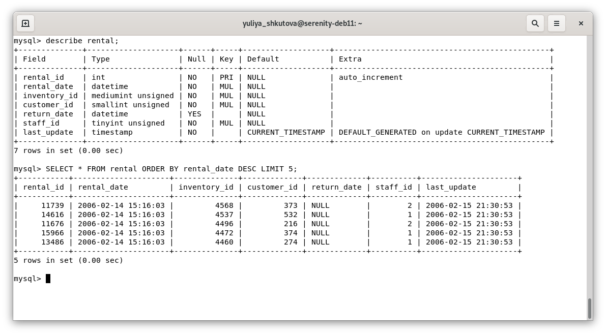

# Домашнее задание к занятию «SQL. Часть 1» Юлия Ш. SYS-19
$~$
> Задание можно выполнить как в любом IDE, так и в командной строке.
> 
> ### Задание 1
> 
> Получите уникальные названия районов из таблицы с адресами, которые начинаются на “K” и заканчиваются на “a” и не содержат пробелов.
>
### Ответ к заданию 1  
```sql
SELECT DISTINCT district FROM address WHERE (district LIKE 'K%a' COLLATE utf8mb4_0900_as_cs) AND (district NOT LIKE '% %');
```


---
> ### Задание 2
> 
> Получите из таблицы платежей за прокат фильмов информацию по платежам, которые выполнялись в промежуток с 15 июня 2005 года по 18 июня 2005 года **включительно** и стоимость которых превышает 10.00.
>
### Ответ к заданию 2  
```sql
SELECT amount, payment_date FROM payment WHERE (amount > 10) AND (payment_date BETWEEN '2005-06-15 00:00:00' AND '2005-06-18 23:59:59');
```


---
> ### Задание 3
> 
> Получите последние пять аренд фильмов.
>
### Ответ к заданию 3
```sql
SELECT * FROM rental ORDER BY rental_date DESC LIMIT 5;
```


---
> ### Задание 4
> 
> Одним запросом получите активных покупателей, имена которых Kelly или Willie. 
> 
> Сформируйте вывод в результат таким образом:
> - все буквы в фамилии и имени из верхнего регистра переведите в нижний регистр,
> - замените буквы 'll' в именах на 'pp'.
>
### Ответ к заданию 4 
```sql
SELECT REPLACE (LOWER (first_name), 'll', 'pp'), LOWER (last_name), active
FROM customer
WHERE (first_name LIKE 'Kelly' OR first_name LIKE 'Willie') AND (active = 1);
```


---
> ## Дополнительные задания (со звёздочкой*)
> Эти задания дополнительные, то есть не обязательные к выполнению, и никак не повлияют на получение вами зачёта по этому домашнему заданию. Вы можете их выполнить, если хотите глубже шире разобраться в материале.
> 
> ### Задание 5*
> 
> Выведите Email каждого покупателя, разделив значение Email на две отдельных колонки: в первой колонке должно быть значение, указанное до @, во второй — значение, указанное после @.
>
### Ответ к заданию 5* 
```sql
SELECT SUBSTRING_INDEX (email, '@', 1), SUBSTRING_INDEX (email, '@', -1)
FROM customer 
LIMIT 10;
```


---
> ### Задание 6*
> 
> Доработайте запрос из предыдущего задания, скорректируйте значения в новых колонках: первая буква должна быть заглавной, остальные — строчными.
>
### Ответ к заданию 6*
```sql
SELECT 
CONCAT(UPPER(LEFT(SUBSTRING_INDEX(email,'@',1),1)), LOWER(SUBSTRING(SUBSTRING_INDEX(email,'@',1),2)) ) AS "name", 
CONCAT(UPPER(LEFT(SUBSTRING_INDEX(email,'@',-1),1)), LOWER(SUBSTRING(SUBSTRING_INDEX(email,'@',-1),2)) ) AS "domain"
FROM customer 
LIMIT 10;
```

