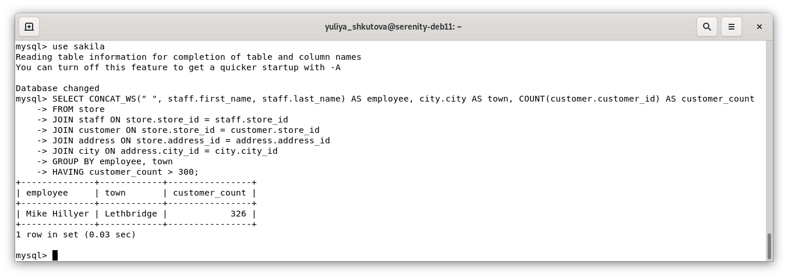
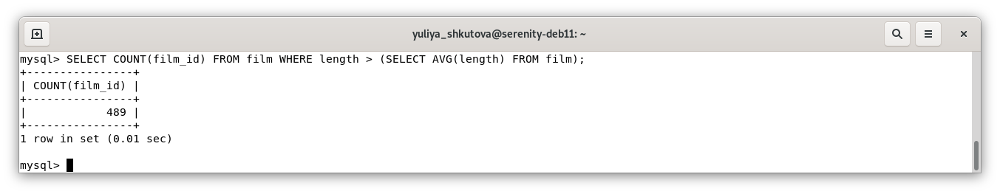
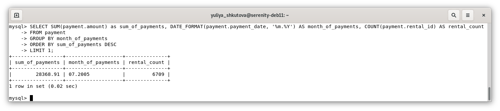
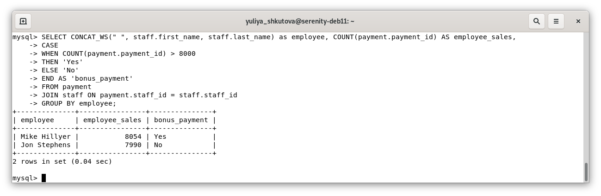
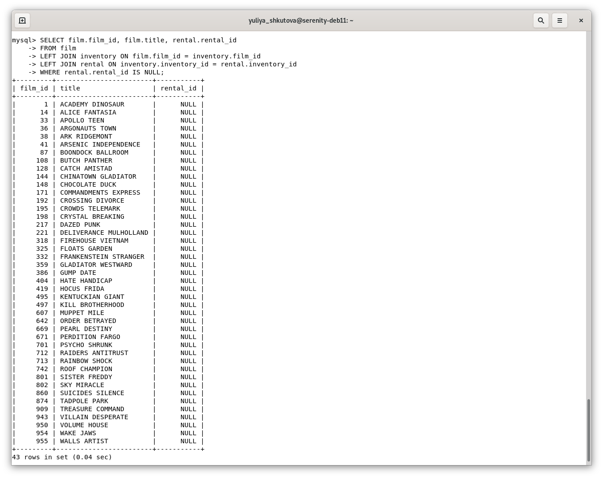

# Домашнее задание к занятию «SQL. Часть 2» Юлия Ш. SYS-19
$~$
> Задание можно выполнить как в любом IDE, так и в командной строке.
> 
> ### Задание 1
> 
> Одним запросом получите информацию о магазине, в котором обслуживается более 300 покупателей, и выведите в результат следующую информацию: 
> - фамилия и имя сотрудника из этого магазина;
> - город нахождения магазина;
> - количество пользователей, закреплённых в этом магазине.
> 
### Ответ к заданию 1  
```sql
SELECT CONCAT_WS(" ", staff.first_name, staff.last_name) AS employee, city.city AS town, COUNT(customer.customer_id) AS customer_count
FROM store
JOIN staff ON store.store_id = staff.store_id
JOIN customer ON store.store_id = customer.store_id
JOIN address ON store.address_id = address.address_id
JOIN city ON address.city_id = city.city_id
GROUP BY employee, town
HAVING customer_count > 300; 
```


---
> ### Задание 2
> 
> Получите количество фильмов, продолжительность которых больше средней продолжительности всех фильмов.
> 
### Ответ к заданию 2 
```sql
SELECT COUNT(film_id) FROM film WHERE length > (SELECT AVG(length) FROM film);
```


---
> ### Задание 3
> 
> Получите информацию, за какой месяц была получена наибольшая сумма платежей, и добавьте информацию по количеству аренд за этот месяц.
> 
### Ответ к заданию 3  
```sql
SELECT SUM(payment.amount) as sum_of_payments, DATE_FORMAT(payment.payment_date, '%m.%Y') AS month_of_payments, COUNT(payment.rental_id) AS rental_count
FROM payment
GROUP BY month_of_payments
ORDER BY sum_of_payments DESC
LIMIT 1;
```


---
> ## Дополнительные задания (со звёздочкой*)
> Эти задания дополнительные, то есть не обязательные к выполнению, и никак не повлияют на получение вами зачёта по этому домашнему заданию. Вы можете их выполнить, если хотите глубже шире разобраться в материале.
> 
> ### Задание 4*
> 
> Посчитайте количество продаж, выполненных каждым продавцом. Добавьте вычисляемую колонку «Премия». Если количество продаж превышает 8000, то значение в колонке будет «Да», иначе должно быть значение «Нет».
> 
### Ответ к заданию 4*
```sql
SELECT CONCAT_WS(" ", staff.first_name, staff.last_name) as employee, COUNT(payment.payment_id) AS employee_sales, 
CASE
WHEN COUNT(payment.payment_id) > 8000 
THEN 'Yes'
ELSE 'No'
END AS 'bonus_payment'
FROM payment
JOIN staff ON payment.staff_id = staff.staff_id
GROUP BY employee;
```


---
> ### Задание 5*
> 
> Найдите фильмы, которые ни разу не брали в аренду.
>
### Ответ к заданию 5*  
```sql
SELECT film.film_id, film.title, rental.rental_id
FROM film
LEFT JOIN inventory ON film.film_id = inventory.film_id
LEFT JOIN rental ON inventory.inventory_id = rental.inventory_id
WHERE rental.rental_id IS NULL;
```

