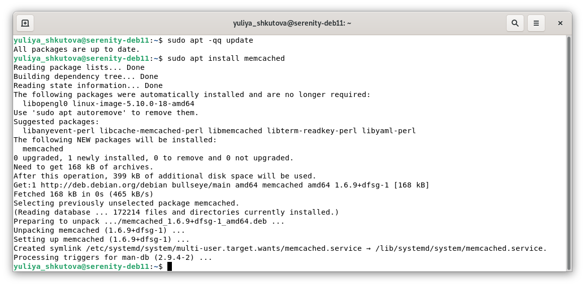
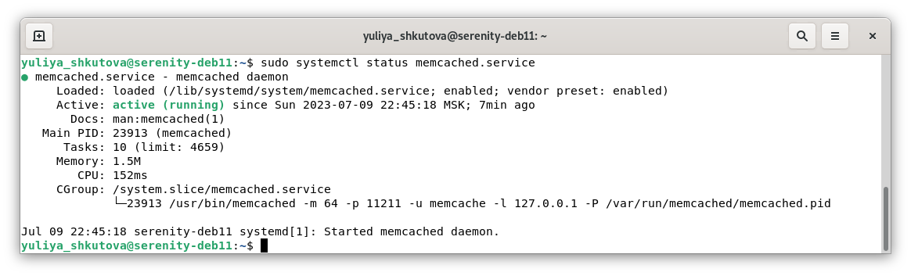
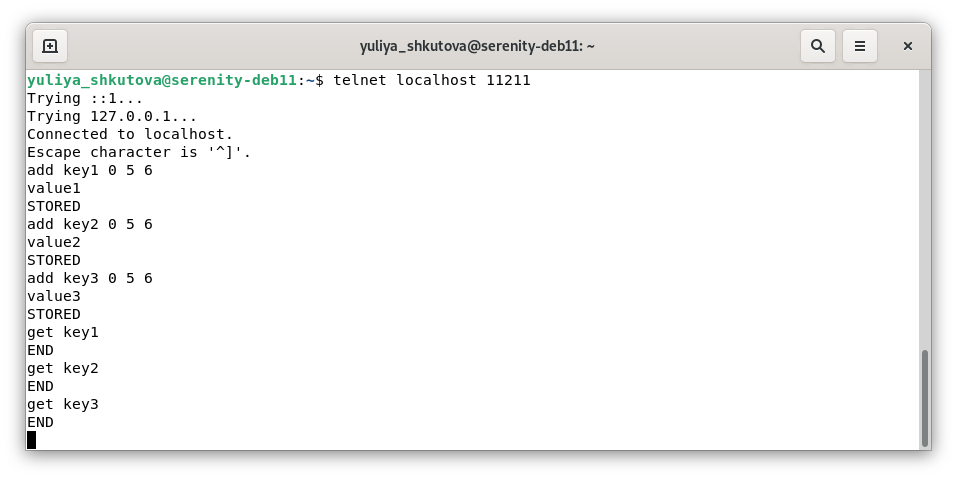
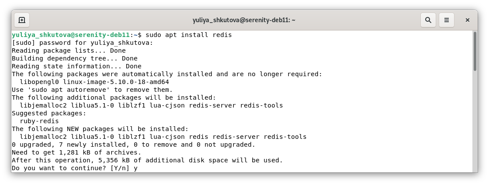
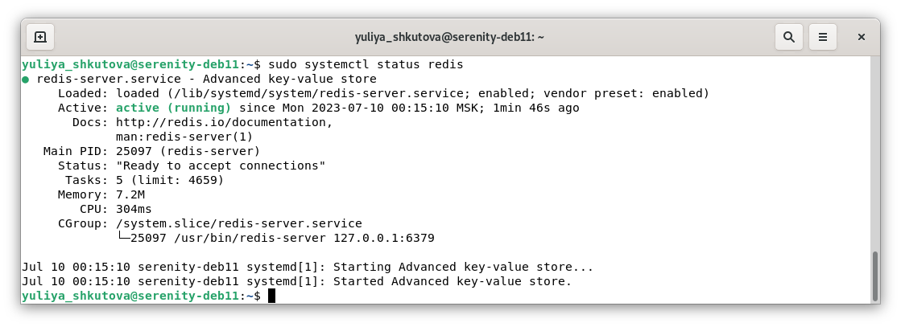
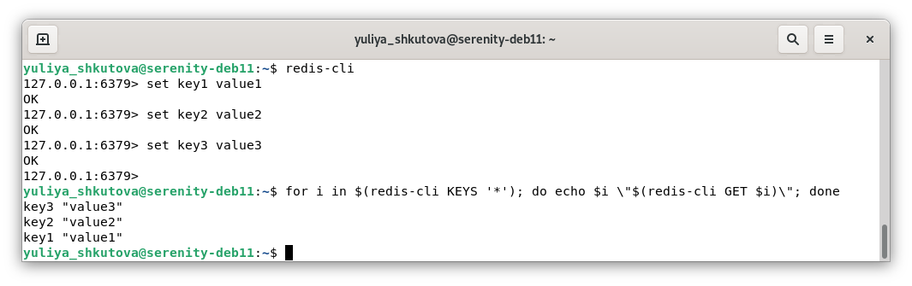
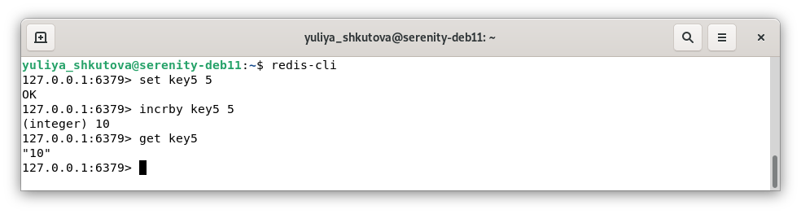

# Домашнее задание к занятию «Кеширование Redis/memcached» Юлия Ш. SYS-19
$~$
> ### Задание 1. Кеширование 
> 
> Приведите примеры проблем, которые может решить кеширование. 
> 
> *Приведите ответ в свободной форме.*

### Ответ к заданию 1. Кеширование

* Повышение производительности (достигается за счет складывания в кэш данных, к которым чаще всего происходит обращение).
*	Увеличение скорости ответа.
*	Экономия ресурсов базы данных (например, при применении кэширования тяжелых запросов).
*	Сглаживание бустов (резкого увеличения) трафика. 

---

> ### Задание 2. Memcached
> 
> Установите и запустите memcached.
> 
> *Приведите скриншот systemctl status memcached, где будет видно, что memcached запущен.*

### Ответ к заданию 2. Memcached

*	Установка memcached:

*	Cкриншот systemctl status memcached, где видно, что memcached запущен:

---

> ### Задание 3. Удаление по TTL в Memcached
> 
> Запишите в memcached несколько ключей с любыми именами и значениями, для которых выставлен TTL 5. 
> 
> *Приведите скриншот, на котором видно, что спустя 5 секунд ключи удалились из базы.*

### Ответ к заданию 3. Удаление по TTL в Memcached

*	Запись в memcached нескольких ключей и значений, для которых выставлен TTL 5; проверка наличия сохраненных значений после истечения 5 секунд:

---

> ### Задание 4. Запись данных в Redis
> 
> Запишите в Redis несколько ключей с любыми именами и значениями. 
> 
> *Через redis-cli достаньте все записанные ключи и значения из базы, приведите скриншот этой операции.*

### Ответ к заданию 4. Запись данных в Redis

*	Установка Redis:

*	Проверка статуса Redis:

 

*	Запись в Redis нескольких ключей и значений; получение всех записанных ключей и значений из базы:

---

> ## Дополнительные задания (со звёздочкой*)
> Эти задания дополнительные, то есть не обязательные к выполнению, и никак не повлияют на получение вами зачёта по этому домашнему заданию. Вы можете их выполнить, если хотите глубже разобраться в материале.
> 
> ### Задание 5*. Работа с числами
> 
> Запишите в Redis ключ key5 со значением типа "int" равным числу 5. Увеличьте его на 5, чтобы в итоге в значении лежало число 10.  
> 
> *Приведите скриншот, где будут проделаны все операции и будет видно, что значение key5 стало равно 10.*

### Ответ к заданию 5*. Работа с числами

*	Запись в Redis ключа key5 со значнием 5; увеличение его на 5; проверка сохраненного значения:

