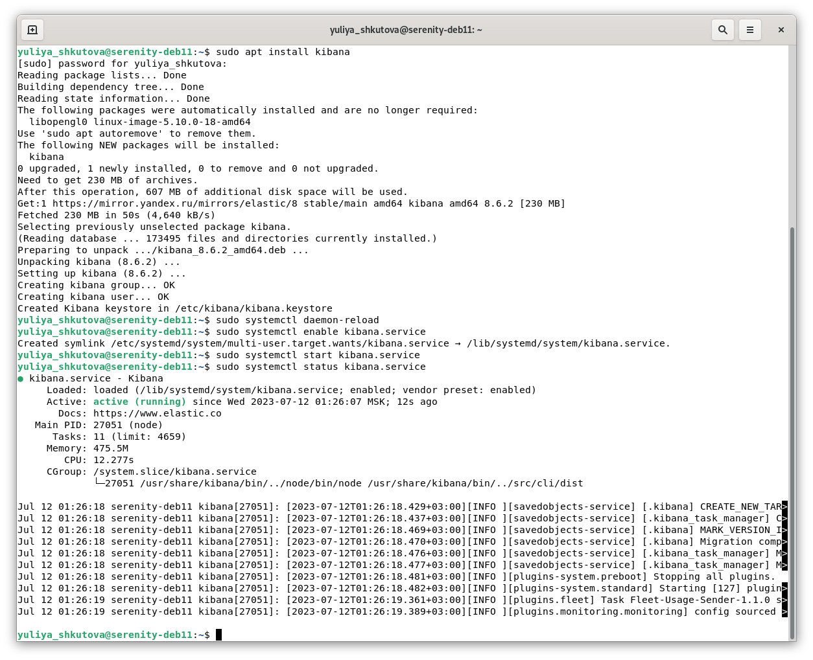

# Домашнее задание к занятию «ELK» Юлия Ш. SYS-19
$~$
> ### Задание 1. Elasticsearch 
> 
> Установите и запустите Elasticsearch, после чего поменяйте параметр cluster_name на случайный. 
> 
> *Приведите скриншот команды 'curl -X GET 'localhost:9200/_cluster/health?pretty', сделанной на сервере с установленным Elasticsearch. Где будет виден нестандартный cluster_name*.

### Ответ к заданию 1. Elasticsearch 
* Установка Elasticsearch с помощью репозитория-зеркала от Яндекса:

* Запуск и проверка статуса установленного Elasticsearch:

* Ссылка на конфигурационный файл Elasticsearch --> [elasticsearch.yml](conf/sysdb-3/elasticsearch.yml).
* Настройка и перезапуск Elasticsearch. Скриншот команды *'curl -X GET 'localhost:9200/_cluster/health?pretty'*, выполненной на сервере с установленным Elasticsearch. В качестве значения *"cluster_name"* установлено "*my-elastic-cluster*":

---

> ### Задание 2. Kibana
> 
> Установите и запустите Kibana.
> 
> *Приведите скриншот интерфейса Kibana на странице http://<ip вашего сервера>:5601/app/dev_tools#/console, где будет выполнен запрос GET /_cluster/health?pretty*.

### Ответ к заданию 2. Kibana 
* Установка, запуск и проверка статуса Kibana:

* Ссылка на конфигурационный файл Kibana --> [kibana.yml](conf/sysdb-3/kibana.yml).
* Настройка, перезапуск, проверка статуса Kibana:

* Скриншот интерфейса Kibana на странице *http://localhost:5601/app/dev_tools#/console*, где выполнен запрос *GET /_cluster/health?pretty*:

---

> ### Задание 3. Logstash
> 
> Установите и запустите Logstash и Nginx. С помощью Logstash отправьте access-лог Nginx в Elasticsearch. 
> 
> *Приведите скриншот интерфейса Kibana, на котором видны логи Nginx.*

### Ответ к заданию 3. Logstash
* Установка Logstash и Nginx:

* Запуск Logstash, проверка статусов Logstash и Nginx:

* Ссылка на конфигурационный файл Logstash --> [nginx_logstash.conf](conf/sysdb-3/1_nginx_logstash.conf).
* Настройка, перезапуск, проверка статуса Logstash:

* Отображение созданного *Data Stream* и его индекса в интерфейсе Kibana:

* Создание *Data view* (в более ранних версиях раздел называется *Index patterns*). Использован дефолтный неймспейс:

* Скриншот созданного *Data view* с логами Nginx:

---

> ### Задание 4. Filebeat 
> 
> Установите и запустите Filebeat. Переключите поставку логов Nginx с Logstash на Filebeat. 
> 
> *Приведите скриншот интерфейса Kibana, на котором видны логи Nginx, которые были отправлены через Filebeat.*

### Ответ к заданию 4. Filebeat
#### Вариант 1. Настройка поставки логов по схеме Filebeat --> Logstash --> Elasticsearch:
* Установка, запуск и проверка статуса Filebeat:

* Ссылка на конфигурационный файл Filebeat --> [filebeat.yml](conf/sysdb-3/1_filebeat.yml).
* Ссылка на конфигурационный файл Logstash --> [nginx_logstash.conf](conf/sysdb-3/2_nginx_logstash.conf).
* Настройка и перезапуск Filebeat и Logstash:

* Отображение созданного индекса в интерфейсе Kibana:

* Создание *Data view*. Использован дефолтный неймспейс:

* Скриншот созданного *Data view* с логами Nginx:

#### Вариант 2. Настройка поставки логов по схеме Filebeat --> Elasticsearch:
* Ссылка на конфигурационный файл Filebeat --> [filebeat.yml](conf/sysdb-3/2_filebeat.yml).
* Остановка Filebeat и Logstash; настройка и запуск Filebeat:

* Отображение созданного индекса в интерфейсе Kibana:

* Создание *Data view*. Использован дефолтный неймспейс:

* Скриншот созданного *Data view* с логами Nginx:

---

> ## Дополнительные задания (со звёздочкой*)
> Эти задания дополнительные, то есть не обязательные к выполнению, и никак не повлияют на получение вами зачёта по этому домашнему заданию. Вы можете их выполнить, если хотите глубже шире разобраться в материале.
> 
> ### Задание 5*. Доставка данных 
> 
> Настройте поставку лога в Elasticsearch через Logstash и Filebeat любого другого сервиса , но не Nginx. 
> Для этого лог должен писаться на файловую систему, Logstash должен корректно его распарсить и разложить на поля. 
> 
> *Приведите скриншот интерфейса Kibana, на котором будет виден этот лог и напишите лог какого приложения отправляется.*

### Ответ к заданию 5*. Доставка данных
#### Настройка поставки логов по схеме Filebeat --> Logstash --> Elasticsearch:
* Создание и тестирование шаблона для Grok filter plugin в интерфейсе Kibana:

* Ссылка на конфигурационный файл Filebeat --> [filebeat.yml](conf/sysdb-3/3_filebeat.yml).
* Ссылка на конфигурационный файл Logstash --> [user_log_logstash.conf](conf/sysdb-3/user_log_logstash.conf).
* Остановка Filebeat; настройка и запуск Filebeat и Logstash;

* Отображение созданного индекса в интерфейсе Kibana:

* Создание *Data view*. Использован дефолтный неймспейс:

* Скриншот созданного *Data view* с логами */var/log/user.log*, разложенными на поля с помощью Logstash:

---

> ## Дополнительные ресурсы
> 
> При выполнении задания используйте дополнительные ресурсы:
> - [docker-compose elasticsearch + kibana](11-03/docker-compose.yaml);
> - [поднимаем elk в docker](https://www.elastic.co/guide/en/elasticsearch/reference/7.17/docker.html);
> - [поднимаем elk в docker с filebeat и docker-логами](https://www.sarulabs.com/post/5/2019-08-12/sending-docker-logs-to-elasticsearch-and-kibana-with-filebeat.html);
> - [конфигурируем logstash](https://www.elastic.co/guide/en/logstash/7.17/configuration.html);
> - [плагины filter для logstash](https://www.elastic.co/guide/en/logstash/current/filter-plugins.html);
> - [конфигурируем filebeat](https://www.elastic.co/guide/en/beats/libbeat/5.3/config-file-format.html);
> - [привязываем индексы из elastic в kibana](https://www.elastic.co/guide/en/kibana/7.17/index-patterns.html);
> - [как просматривать логи в kibana](https://www.elastic.co/guide/en/kibana/current/discover.html);
> - [решение ошибки increase vm.max_map_count elasticsearch](https://stackoverflow.com/questions/42889241/how-to-increase-vm-max-map-count).
