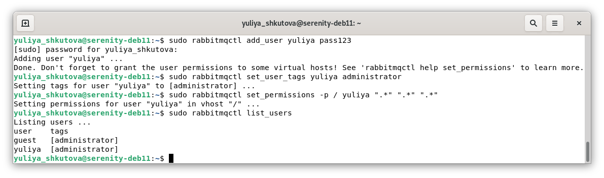
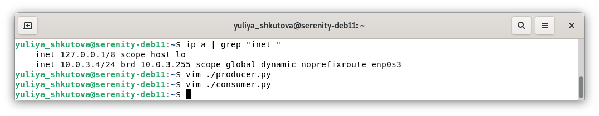
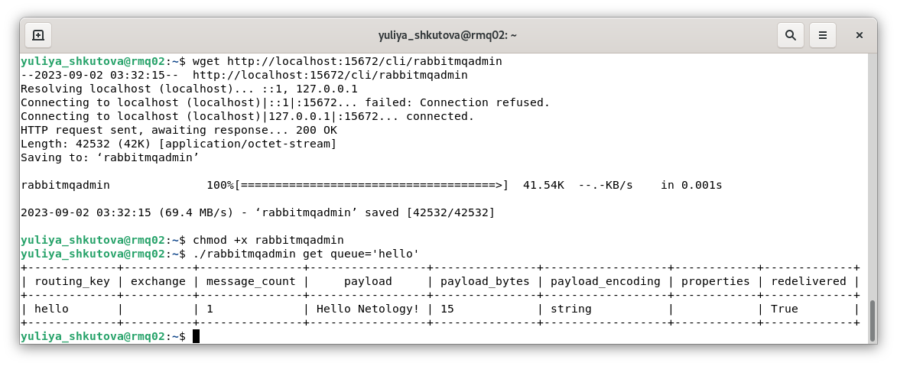
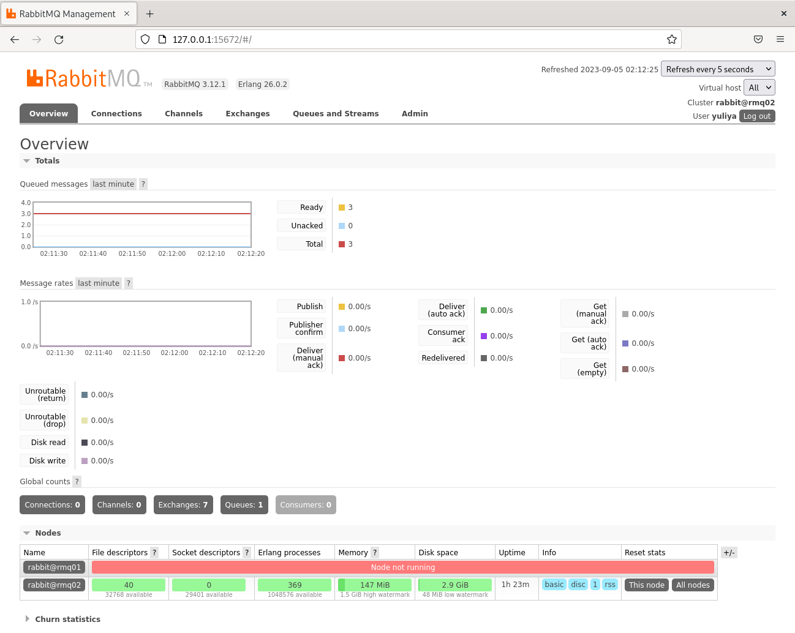
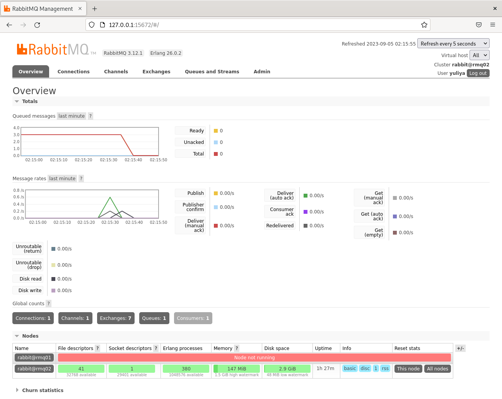

# Домашнее задание к занятию «Очереди RabbitMQ» Юлия Ш. SYS-19
$~$
> ### Задание 1. Установка RabbitMQ
> 
> Используя Vagrant или VirtualBox, создайте виртуальную машину и установите RabbitMQ.
> Добавьте management plug-in и зайдите в веб-интерфейс.
> 
> *Итогом выполнения домашнего задания будет приложенный скриншот веб-интерфейса RabbitMQ.*
> 
### Ответ к заданию 1. Установка RabbitMQ
* Установка RabbitMQ с помощью [Cloudsmith Quick Start Script](https://www.rabbitmq.com/install-debian.html#apt-quick-start-cloudsmith):

* Ссылка на скрипт:
  - [RabbitMQ_Cloudsmith_Quick_Start_Script.sh](conf/sysdb-4/RabbitMQ_Cloudsmith_Quick_Start_Script.sh)
* Проверка версии и статуса приложения:

* Добавление *management plug-in*:

* Создание пользователя, присвоение ему статуса администратора и полных прав; проверка списка пользователей:

* Выполнение авторизации в веб-интерфейсе:


---
> ### Задание 2. Отправка и получение сообщений
> 
> Используя приложенные скрипты, проведите тестовую отправку и получение сообщения.
> Для отправки сообщений необходимо запустить скрипт producer.py.
> 
> Для работы скриптов вам необходимо установить Python версии 3 и библиотеку Pika.
> Также в скриптах нужно указать IP-адрес машины, на которой запущен RabbitMQ, заменив localhost на нужный IP.
> 
> ```shell script
> $ pip install pika
> ```
> 
> Зайдите в веб-интерфейс, найдите очередь под названием hello и сделайте скриншот.
> После чего запустите второй скрипт consumer.py и сделайте скриншот результата выполнения скрипта
> 
> *В качестве решения домашнего задания приложите оба скриншота, сделанных на этапе выполнения.*
> 
> Для закрепления материала можете попробовать модифицировать скрипты, чтобы поменять название очереди и отправляемое сообщение.
> 
### Ответ к заданию 2. Отправка и получение сообщений
* Проверка версии *python*, установка пакетного менеджера *pip*:

* Установка библиотеки *pika*:

* Загрузка скриптов из задания:

* Предоставление прав на запуск скриптов:

* Проверка адреса виртуальной машины и редактирование скриптов:

* Ссылки на отредактированные скрипты:
  - [producer.py](conf/sysdb-4/producer.py);
  - [consumer.py](conf/sysdb-4/consumer.py).
* Запуск *producer.py*:

* Отображение результата в веб-интерфейсе:


* Запуск *consumer.py*:

* Отображение результата в веб-интерфейсе:


---
> ### Задание 3. Подготовка HA кластера
> 
> Используя Vagrant или VirtualBox, создайте вторую виртуальную машину и установите RabbitMQ.
> Добавьте в файл hosts название и IP-адрес каждой машины, чтобы машины могли видеть друг друга по имени.
> 
> Пример содержимого hosts файла:
> ```shell script
> $ cat /etc/hosts
> 192.168.0.10 rmq01
> 192.168.0.11 rmq02
> ```
> После этого ваши машины могут пинговаться по имени.
> 
> Затем объедините две машины в кластер и создайте политику ha-all на все очереди.
> 
> *В качестве решения домашнего задания приложите скриншоты из веб-интерфейса с информацией о доступных нодах в кластере и включённой политикой.*
> 
> Также приложите вывод команды с двух нод:
> 
> ```shell script
> $ rabbitmqctl cluster_status
> ```
> 
> Для закрепления материала снова запустите скрипт producer.py и приложите скриншот выполнения команды на каждой из нод:
> 
> ```shell script
> $ rabbitmqadmin get queue='hello'
> ```
> 
> После чего попробуйте отключить одну из нод, желательно ту, к которой подключались из скрипта, затем поправьте параметры подключения в скрипте consumer.py на вторую ноду и запустите его.
> 
> *Приложите скриншот результата работы второго скрипта.*
> 
### Ответ к заданию 3. Подготовка HA кластера
* Проверка предварительно измененных файлов *hostname* и *hosts*, создание конфигурационного файла для настройки кластера *RabbitMQ* на обеих виртуальных машинах (ВМ):


* Ссылка на конфигурационный файл для настройки кластера RabbitMQ:
  - [rabbitmq.conf](conf/sysdb-4/rabbitmq.conf);
* Проверка текущего статуса использования конфигурационных файлов, перезапуск и проверка статуса *RabbitMQ* на обеих ВМ:


* Вывод содержимого файла *.erlang.cookie* на ВМ *rmq01*:

* Замена содержимого файла *.erlang.cookie* ВМ *rmq02* на данные с ВМ *rmq01*, перезапуск и проверка статуса *RabbitMQ* на *rmq02*:

* Остановка *RabbitMQ* и подключение к кластеру ВМ *rmq02* на *rmq01*:

* Запуск *RabbitMQ* на ВМ *rmq01*:

* Проверка статуса кластера на ВМ *rmq01*:


* Проверка статуса кластера на ВМ *rmq02*:


* Установка политики ha-all для всех очередей:

* Список нод в веб-интерфейсе:

* Список политик в веб-интерфейсе:

* Запуск скрипта *producer.py*:

* Результат в веб-интерфейсе:

* Установка *rabbitmqadmin* на ВМ *rmq01*:

* Вывод команды ```rabbitmqadmin get queue='hello'``` на ВМ *rmq01* (почему-то счетчик сообщений получает значение 0 при первом и 1 при втором запуске скрипта при этом в веб-интерфейсе счет идет корректно: 2 запуска = 2 сообщения):


* Установка *rabbitmqadmin* и вывод команды ```rabbitmqadmin get queue='hello'``` на ВМ *rmq02* (результат не отличается от ВМ *rmq01*):

* Остановка и проверка статуса *RabbitMQ*, редактирование и запуск [*producer2.py*](conf/sysdb-4/producer2.py) на ВМ *rmq01*:

* Проверка результата на ВМ *rmq02*:


* Редактирование и запуск [*consumer2.py*](conf/sysdb-4/consumer2.py) на ВМ *rmq01*:

* Проверка результата на ВМ *rmq02*:


---
> ## Дополнительные задания (со звёздочкой*)
> Эти задания дополнительные, то есть не обязательные к выполнению, и никак не повлияют на получение вами зачёта по этому домашнему заданию. Вы можете их выполнить, если хотите глубже шире разобраться в материале.
> 
> ### * Задание 4. Ansible playbook
> 
> Напишите плейбук, который будет производить установку RabbitMQ на любое количество нод и объединять их в кластер.
> При этом будет автоматически создавать политику ha-all.
> 
> *Готовый плейбук разместите в своём репозитории.*
>
### * Задание 4. Ansible playbook не выполнялось.
