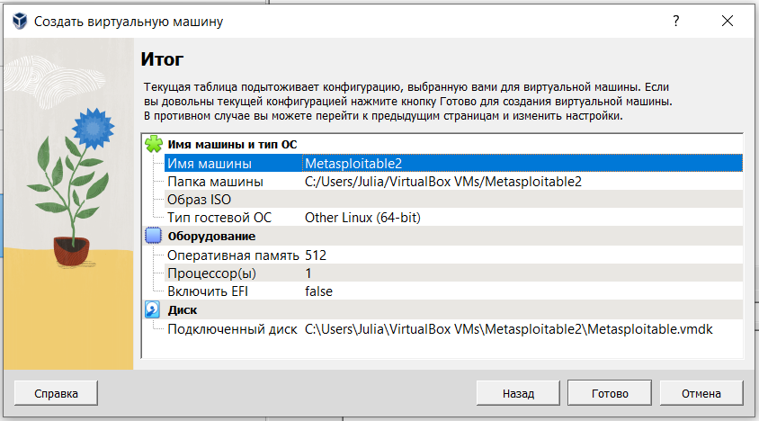
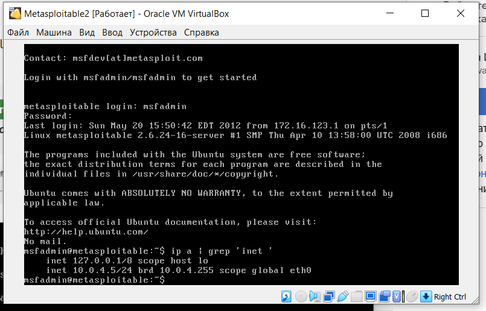
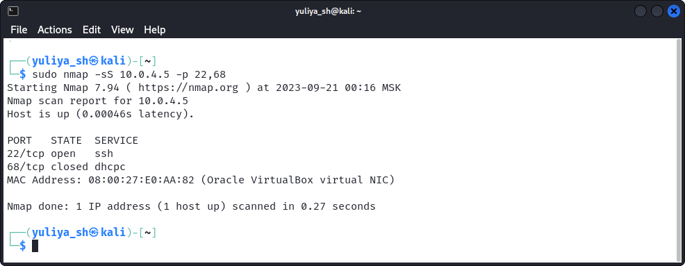
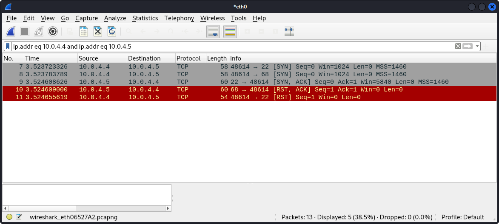
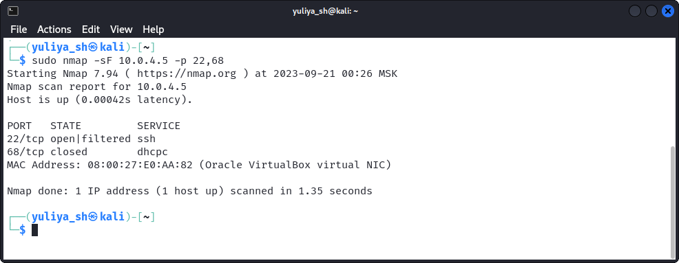
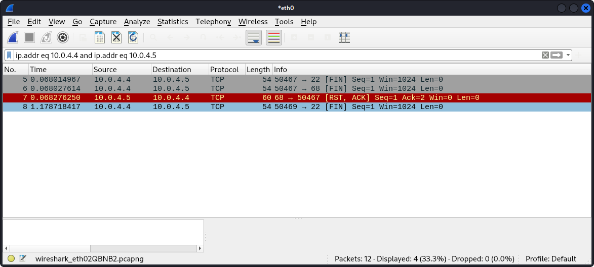
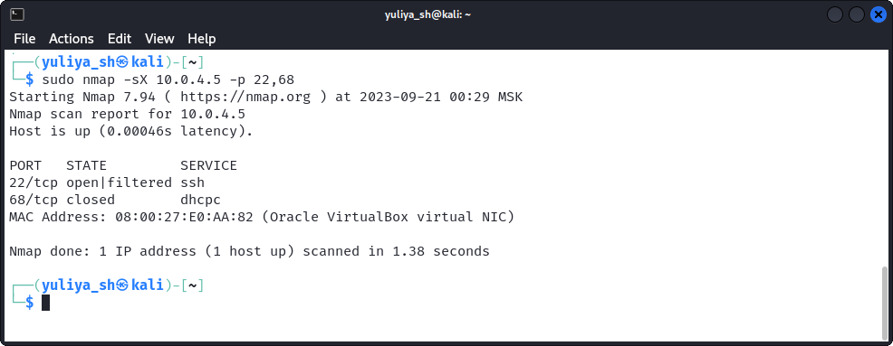
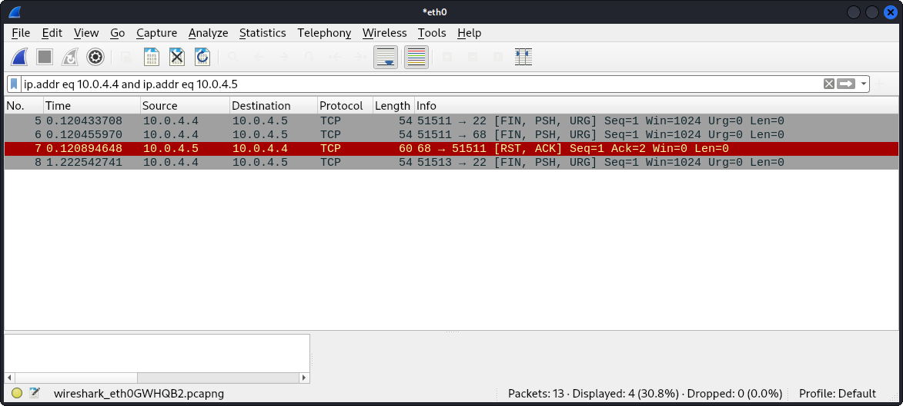
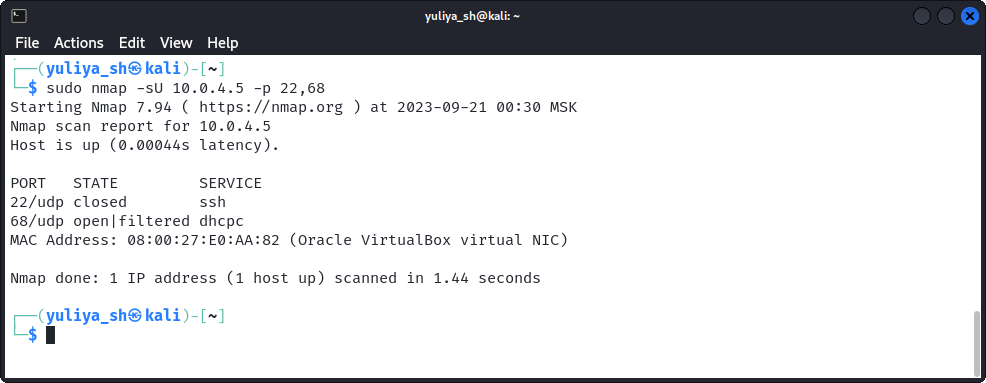
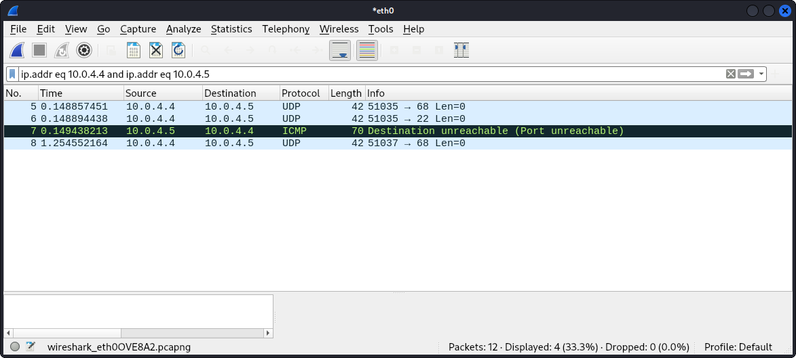

# Домашнее задание к занятию «Уязвимости и атаки на информационные системы» Юлия Ш. SYS-19
$~$
> ### Задание 1
> 
> Скачайте и установите виртуальную машину Metasploitable: https://sourceforge.net/projects/metasploitable/.
> 
> Это типовая ОС для экспериментов в области информационной безопасности, с которой следует начать при анализе уязвимостей.
> 
> Просканируйте эту виртуальную машину, используя **nmap**.
> 
> Попробуйте найти уязвимости, которым подвержена эта виртуальная машина.
> 
> Сами уязвимости можно поискать на сайте https://www.exploit-db.com/.
> 
> Для этого нужно в поиске ввести название сетевой службы, обнаруженной на атакуемой машине, и выбрать подходящие по версии уязвимости.
> 
> Ответьте на следующие вопросы:
> 
> - Какие сетевые службы в ней разрешены?
> - Какие уязвимости были вами обнаружены? (список со ссылками: достаточно трёх уязвимостей)
>   
> *Приведите ответ в свободной форме.*  
### Ответ к заданию 1
* Предварительно в соответствии с [официальной документацией](https://www.kali.org/docs/virtualization/import-premade-virtualbox/) установлена виртуальная машина (ВМ) с Kali Linux.
* Установка, запуск, выполнение входа и проверка сетевого адреса ВМ *Metasploitable 2*:
  


  
* Результат сканирования ВМ *Metasploitable 2* с использованием *nmap*:
```bash
sudo nmap -sV -O 10.0.4.5
```
  

  
* Список из трех примеров уязвимостей со ссылками:
  - vsftpd 2.3.4 - https://www.exploit-db.com/exploits/49757
  - ProFTPD 1.3.1 - https://www.exploit-db.com/exploits/15449
  - MySQL 5.0.51a-3ubuntu5 -  https://www.exploit-db.com/exploits/30020
  
> ### Задание 2
> 
> Проведите сканирование Metasploitable в режимах SYN, FIN, Xmas, UDP.
> 
> Запишите сеансы сканирования в Wireshark.
> 
> Ответьте на следующие вопросы:
> 
> - Чем отличаются эти режимы сканирования с точки зрения сетевого трафика?
> - Как отвечает сервер?
> 
> *Приведите ответ в свободной форме.*
### Ответ к заданию 2
* При выполнении задания сканирование было ограничено портами 22 и 68 для большей наглядности.
* Сканирование Metasploitable в режиме SYN:
  ```bash
  nmap -sS 10.0.4.5 -p 22,68
  ```
  - **Порт 22**: nmap запускает процесс установления соединения с сервером по протоколу TCP (трехстороннее рукопожатие) - запрос с флагом SYN (синхронизации). От сервера получен ответ с флагами SYN, ACK (подтверждения синхронизации). nmap сбрасывает соединение с помощью RST (сброс соединения). Порт считается открытым.
  - **Порт 68**: nmap запускает процесс установления соединения с сервером по протоколу TCP (трехстороннее рукопожатие) - запрос с флагом SYN. От сервера получен ответ с флагами RST, ACK (сброс соединения с подтверждением). Порт считается закрытым.
  - Такое сканирование считается более скрытым. В отличие от полноценного TCP-подключения, оставляет меньше следов и может помочь обойти некоторые недостаточно продвинутые фаерволы.
    


  
* Сканирование Metasploitable в режиме FIN:
  ```bash
  nmap -sF 10.0.4.5 -p 22,68
  ```
  - **Порт 22**: nmap посылает сообщение с флагом FIN (завершения соединения). От сервера ответ не получен. nmap повторно отправляет FIN. Ответ также не получен. Порт считается открытым или фильтруемым.
  - **Порт 68**: nmap посылает сообщение с флагом FIN. От сервера получен ответ с флагами RST, ACK. Порт считается закрытым.
  - Как и Xmas, рассмотренное ниже, FIN-сканирование считается еще более скрытым, но менее точным, т.к. нет возможности определить, является ли порт открытым или фильтруемым, и не все системы работают в соответствии RFC 793, на который опирается nmap.
  


  
* Сканирование Metasploitable в режиме Xmas:
```bash
nmap -sX 10.0.4.5 -p 22,68
```
  - **Порт 22**: nmap посылает сообщение с флагами FIN, PSH (проталкивания данных, из приемного буфера, в приложение пользователя) и URG (указания важности). От сервера ответ не получен. nmap повторно отправляет FIN, PSH и URG. Ответ также не получен. Порт считается открытым или фильтруемым.
  - **Порт 68**: nmap посылает сообщение с флагами FIN, PSH и URG. От сервера получен ответ с флагами RST, ACK. Порт считается закрытым.



  
* Сканирование Metasploitable в режиме UDP:
```bash
nmap -sU 10.0.4.5 -p 22,68
```
  - **Порт 22**: nmap посылает пустой UDP заголовок. От сервера получено ICMP сообщение о недостижимости порта. Порт считается закрытым.
  - **Порт 68**: nmap посылает пустой UDP заголовок. От сервера ответ не получен. nmap повторно отправляет пустой UDP заголовок. Ответ также не получен. Порт считается открытым или фильтруемым.
  - В отличие от трех предыдущих, вместо TCP данный тип сканирования использует протокол UDP. Из-за особенностей протокола (открытые и фильтруемые порты редко отвечают, вынуждая nmap отправлять повторные запросы) и наличия ограничений, установленных по умолчанияю для ICMP сообщений о недостижимости порта (например, не более одного сообщения в секунду), процесс сканирования занимает гараздо больше времени.
  


